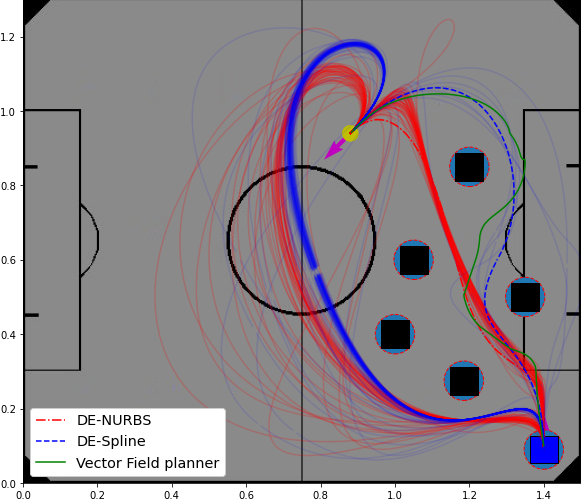

# An Autonomous Mobile Robot Path Planner using Splines and Differential Evolution
[](https://zenodo.org/badge/latestdoi/447218821)
## Install

```bash
pip install -r "requirements.txt"
```

### Install package

(Check the version of the package in the dist folder)

#### Windows
```bash
pip install .\dist\depathplanners-0.0.1-py3-none-any.whl 
```
#### Linux
```bash
pip install "./dist/de2Dplanners-1.0-py3-none-any.whl" 
```

If this package is already installed, you can use this:

```bash
pip install ./dist/depathplanners-1.0-py3-none-any.whl --force-reinstall
```

## Examples

The examples can be executed using [examples.ipynb](examples.ipynb).

## Results

We evaluate the proposed planners executing 100 tests were performed for different scenarios, considering 100 individuals for the initial populations and Nmax = 2000 generations for both DE-NURBS and DE-Spline.

### Case 1

### Case 2

### Case 3

### Case 4


### Straight path


## Cite us

